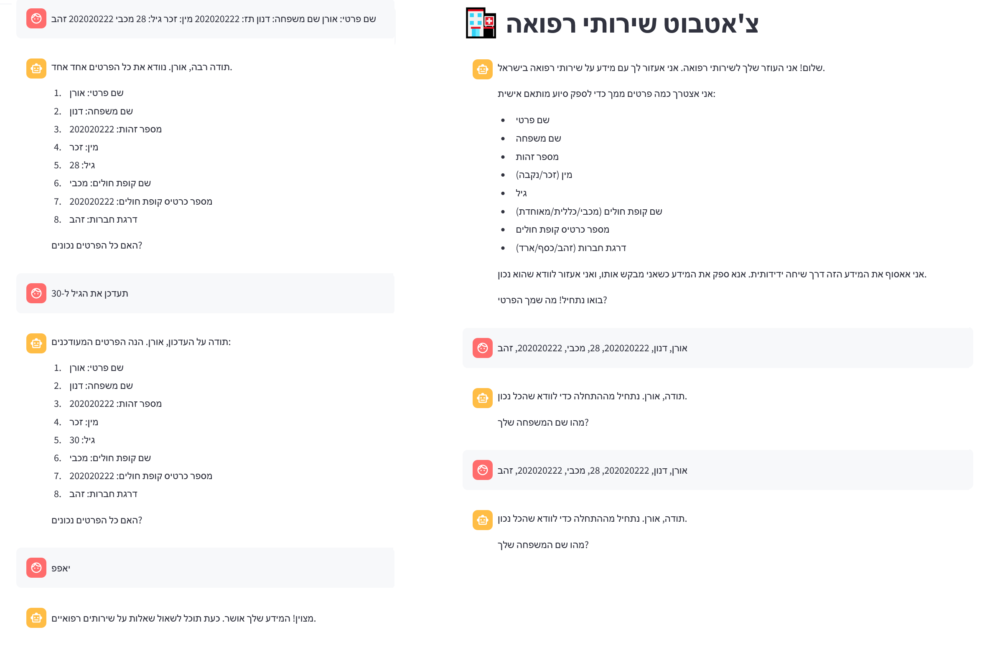
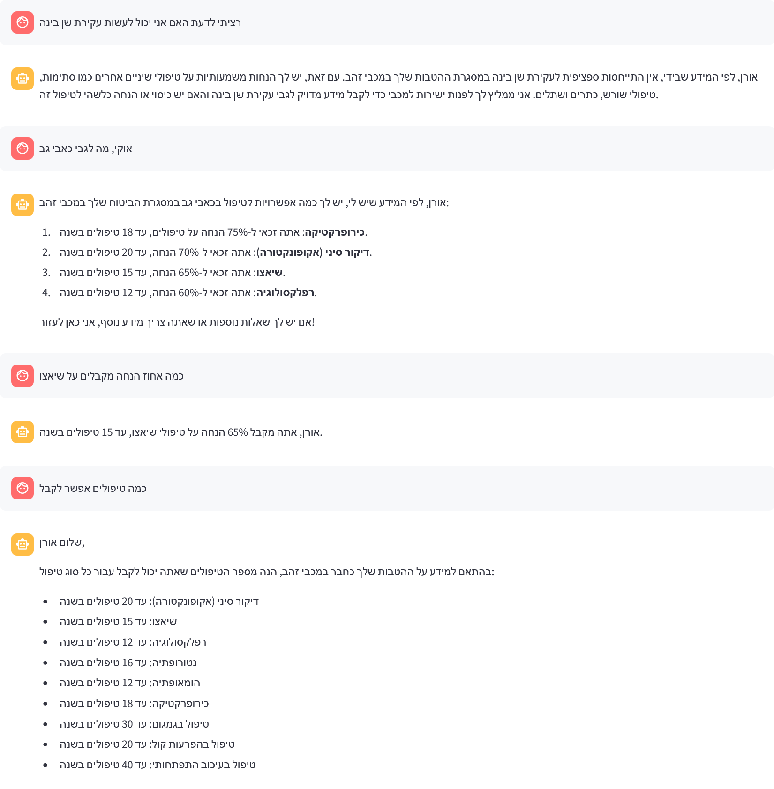
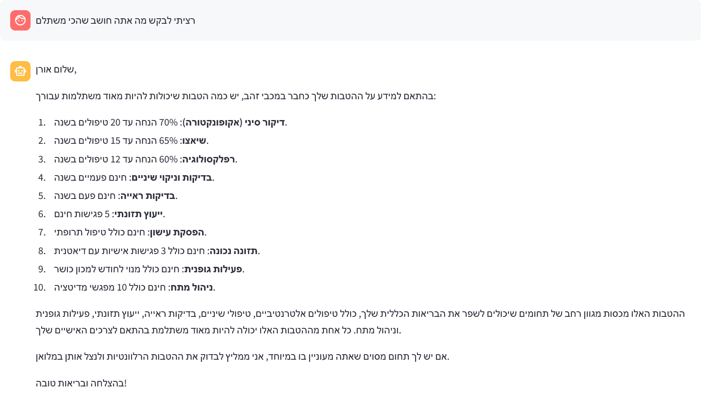

# Medical Services Chatbot

A bilingual (Hebrew/English) chatbot system that provides personalized information about medical services for Israeli HMOs (Maccabi, Meuhedet, and Clalit) based on user-specific information.

[[Demo]](https://youtu.be/Wnrc8u9MQO8)


## Features

### Core Functionality
- Bilingual support (Hebrew/English with RTL handling)
- Two-phase interaction:
  1. Information collection (HMO, membership tier, etc.)
  
  2. Personalized Q&A about medical services
- Stateless microservice architecture
- Integration with Azure OpenAI GPT-4
- Tailored responses based on user's HMO and membership tier


### Technical Features
- FastAPI backend with comprehensive API endpoints
- Streamlit frontend with modern UI
- Comprehensive logging and monitoring
- Health checks and system metrics
- Prometheus integration for metrics collection
- Structured JSON logging

## Architecture

### Components
1. **Frontend (Streamlit)**
   - User interface
   - Language selection
   - Chat interface
   - Health status display
   - Real-time monitoring

2. **Backend (FastAPI)**
   - User information collection
   - Q&A service
   - Health monitoring
   - Metrics collection

3. **Knowledge Base**
   - Structured data for each HMO and tier
   - Service-specific benefits and coverage
   - Multilingual support
   ```json
   {
     "HMO_NAME": {
       "TIER": {
         "SERVICE": "BENEFIT_DESCRIPTION"
       }
     }
   }
   ```
   
   Example:
   ```json
   {
     "מכבי": {
       "זהב": {
         "דיקור סיני": "70% הנחה, עד 20 טיפולים בשנה",
         "שיאצו": "65% הנחה, עד 15 טיפולים בשנה"
       }
     }
   }
   ```

### Monitoring and Logging

#### Logging System
- Structured JSON logging
- Log levels (INFO, ERROR)
- Contextual information tracking
- Error tracking with stack traces
- Request/response logging

#### Health Checks
- System status monitoring
- Resource usage tracking
- Service availability checks
- Performance metrics

#### Metrics Collection
- Request counts by endpoint
- Response latency tracking
- Error rates and types
- System resource usage
- Service uptime

## Setup and Installation

1. Clone the repository:
```bash
git clone https://github.com/OranDanon/Gen-AI-Assignment
cd medical_services_chatbot
```

2. Install dependencies:
```bash
pip install -r requirements.txt
```

3. Set up environment variables:
```bash
# Azure OpenAI API Configuration
AZURE_OPENAI_ENDPOINT=
AZURE_OPENAI_KEY=
AZURE_OPENAI_DEPLOYMENT_NAME=gpt-4o
AZURE_API_VERSION=2025-01-01-preview

# FastAPI and Streamlit Configuration
API_BASE_URL=http://localhost:8000
PORT=8000
```

4. Start the services:
```bash
# Start FastAPI backend
uvicorn core.fastapi_backend:app --host 0.0.0.0 --port 8000

# Start Streamlit frontend
streamlit run streamlit_app.py
```

## API Endpoints

### Health and Monitoring
- `GET /health`: System health status
- `GET /metrics`: Prometheus metrics

### Core Endpoints
- `GET /welcome-message/{language}`: Get welcome message
- `POST /process-input`: Process user input
- `POST /extract-user-info`: Extract user information
- `POST /get-answer`: Get personalized answers


## Evaluation Results

The system has been evaluated using multiple metrics and models. Key findings:

1. **Model Selection**
   - Achieved high similarity scores of several embedding models with ground truth answers

2. **Lowest Similarity Scores**
   - Pregnancy follow-up benefits (0.887)
   - Pregnancy and childbirth workshop (0.896)
   - Diabetes workshop (0.926)

3. **Areas for Improvement**
   - Adding more contextual information from HTML sources (sub-services descriptions, contact info, etc.)
   - Choosing dedicated Hebrew language model support

| Question                                                              | Ground Truth Answer                                                                                                                                  | Generated Answer                                                                                                                                                                                                                                                                                                                                                                                                                      | Score          |
|----------------------------------------------------------------------|----------------------------------------------------------------------------------------------------------------------------------------------------|------------------------------------------------------------------------------------------------------------------------------------------------------------------------------------------------------------------------------------------------------------------------------------------------------------------------------------------------------------------------------------------------------------------------------------|----------------|
| What are the benefits in pregnancy follow-up?                         | As a Meuhedet Gold member, you are entitled to free pregnancy follow-up, including personal digital monitoring                                         | Hi Michal, As a member of Meuhedet Gold, you have several comprehensive benefits for pregnancy follow-up. Here are the details: 1. Pregnancy Follow-Up (מעקב הריון): This is provided for free and includes a personal digital follow-up. 2. Genetic Screening Tests (בדיקות סקר גנטיות): You receive an 85% discount, which includes advanced tests. ... | 0.8874751925   |
| What are the benefits in the pregnancy and childbirth workshop?       | As a Maccabi Gold member, you are entitled to a free pregnancy and childbirth workshop, including an infant CPR course                                | Hi Dana, Based on your Maccabi Gold membership, you have some great benefits related to pregnancy and childbirth. Here are the details: 1. Pregnancy Monitoring: Free, including the choice of a specialist doctor. 2. Genetic Screening Tests: 90% discount, including genetic counseling. 3. System Scans: Free, including both early and late scans. ... | 0.8960604668   |
| What are the benefits in the pregnancy and childbirth workshop?       | As a Meuhedet Gold member, you are entitled to a free pregnancy and childbirth workshop, including 3 breastfeeding consultation sessions               | Hi Michal, Based on your Meuhedet Gold membership, you have some great benefits related to pregnancy and childbirth. Here are the details: 1. Pregnancy Monitoring: Free, including digital personal monitoring. 2. Genetic Screening Tests: 85% discount, including advanced tests. 3. System Scans: Free, including 3D scans. 4. Childbirth Preparation Course: Free... | 0.9006370902   |
| What are the benefits in the pregnancy and childbirth workshop?       | As a Clalit Gold member, you are entitled to a free pregnancy and childbirth workshop, including an infant massage workshop                           | Hi Shira, Based on your Clalit Gold membership, you have some great benefits related to pregnancy and childbirth. Here are the details for the pregnancy and childbirth workshop: - Pregnancy Monitoring: Free, including 24/7 telephone consultation. - Genetic Screening Tests: 95% discount, including comprehensive interpretation. - System Scans: Free... | 0.9015983343   |
| What are the benefits in pregnancy follow-up?                         | As a Clalit Gold member, you are entitled to free pregnancy follow-up, including 24/7 telephone consultation                                        | Hi Shira, For pregnancy follow-up, you have several great benefits with your Clalit Gold membership. Here’s what you can expect: 1. Pregnancy Follow-Up (מעקב הריון): This is completely free and includes 24/7 telephone consultation. 2. Genetic Screening Tests (בדיקות סקר גנטיות): You get a 95% discount, which includes comprehensive interpretation. ... | 0.9062027931   |
| What are the benefits in pregnancy follow-up?                         | As a Maccabi Gold member, you are entitled to free pregnancy follow-up, including choosing a specialist doctor                                       | Hi Dana, For pregnancy follow-up, you have some excellent benefits with your Maccabi Gold membership. Here’s what you’re entitled to: 1. Pregnancy Follow-Up: This is completely free and includes the option to choose a specialist doctor for your care. 2. Genetic Screening Tests: You get a 90% discount on these tests, which also includes genetic counseling. ... | 0.9186504483   |
| What are the benefits in the diabetes workshop?                       | As a Meuhedet Gold member, you are entitled to a free diabetes workshop, including personal guidance from a diabetes nurse                           | Hi Michal, As a member of Meuhedet Gold, you have access to a comprehensive diabetes workshop. The benefits for this workshop include: - Free participation in the workshop. - Personal guidance and support from a diabetes nurse. This program is designed to help you manage your diabetes effectively with professional support and resources. | 0.9269774556   |
| מה ההטבות במעקב הריון?                                               | כמבוטחת כללית במסלול זהב, את זכאית למעקב הריון חינם, כולל ייעוץ טלפוני 24/7                                                                         | שלום שירה, אני רואה שאת מבוטחת בכללית בתוכנית זהב. לפי המידע שיש לי, ההטבות שלך במעקב הריון כוללות: - מעקב הריון חינם, כולל ייעוץ טלפוני 24/7. - בדיקות סקר גנטיות בהנחה של 95%, כולל פענוח מורחב. - סקירות מערכות חינם, כולל צילום וידאו של הסקירה. - קורס הכנה ללידה חינם, כולל מפגש עם יועצת הנקה. - טיפול בסיבוכי הריון עם כיסוי של 95%, כולל התייעצות עם מומחים. | 0.9286696315   |
| How long is the wait time for dental check-ups and cleanings?         | As a Maccabi Gold member, wait time for dental check-ups and cleanings is within 48 hours                                                            | Hi Dana, For dental check-ups and cleanings, you have a great benefit with your Maccabi Gold membership. You can get these services for free twice a year, and the wait time for an appointment is within 48 hours. So, you can schedule your dental check-up and cleaning and expect to be seen quickly. If you have any other questions about your benefits or need assistance with anything else, feel free to ask! | 0.9340901375   |


## Monitoring Dashboard

Access the monitoring dashboard at:
- Prometheus metrics: `http://localhost:8001/metrics`
- Health status: `http://localhost:8000/health`


## License

This project is licensed under the MIT License - see the LICENSE file for details.