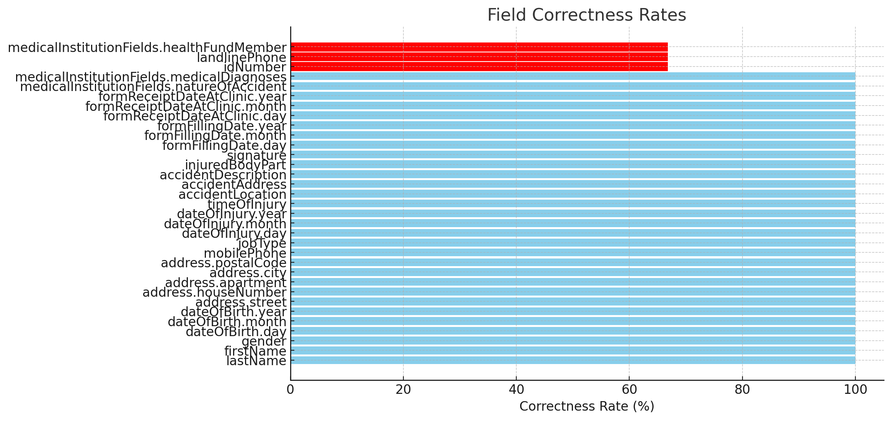

# National Insurance Form Extraction System

## Overview

This project is an end-to-end document processing system designed to extract structured data from National Insurance Institute forms. It uses Azure Document Intelligence for OCR and Azure OpenAI for intelligent field extraction, with a user-friendly Streamlit interface.

## Features

- **Document OCR**: Processes PDF and image files to extract text content using Azure Document Intelligence
- **Intelligent Field Extraction**: Uses LLM-based parsing to extract structured data following predefined schemas
- **Comprehensive Evaluation**: Includes metrics for completion rates and extraction accuracy
- **User-Friendly Interface**: Simple web interface for document upload and results display

## Architecture

The system follows a modular design with these key components:

1. **OCR Processor**: Converts document images to text using Azure Document Intelligence
2. **Field Extractor**: Parses the text to extract structured data in JSON format
3. **Evaluation Framework**: Assesses extraction quality through completion and correctness metrics
4. **Web Interface**: Provides a user-friendly front-end for document processing

## Evaluation Results

The system was evaluated using the provided test data. As there are only 3 examples this is not considered rigours test, however we show how such evaluation would have been done. 
`convertor_completion_evaluator.py` show how to evaluate over test data with no ground truth, and `eval_correctness` show how to evaluate with ground truth. Here are the results.


The evaluation identified that certain fields like `healthFundMember`, `idNumber`, and `landlineNumber` would benefit from Azure Query fields for more accurate extraction.

## Best Practices Implemented

- **Modular Architecture**: Clear separation of concerns for maintainability
- **Comprehensive Error Handling**: Robust try-except blocks throughout the codebase
- **Extensive Logging**: Detailed logging for debugging and monitoring
- **Prompt Engineering**: Carefully crafted LLM prompts with examples for optimal extraction
- **Evaluation Framework**: Metrics to assess both completion and correctness

## Installation

1. Clone the repository:
```bash
git clone https://github.com/OranDanon/insurance-form-extraction.git
cd insurance-form-extraction
```

2. Install dependencies: 
```bash 
pip install streamlit azure-ai-documentintelligence azure-core langchain langchain_openai pydantic python-dotenv
```

3. Create a .env file with your Azure credentials: 
```python
# Azure Document Intelligence
DOCUMENT_INTELLIGENCE_ENDPOINT=your_endpoint
DOCUMENT_INTELLIGENCE_KEY=your_key

# Azure OpenAI
AZURE_OPENAI_ENDPOINT=your_endpoint
AZURE_OPENAI_API_KEY=your_key
AZURE_OPENAI_API_VERSION=api-version
```

4. Run the Streamlit Application
```bash
streamlit run app.py
```

### Future Improvements
Implement Azure Query fields for more accurate extraction of healthFundMember, idNumber, and landlineNumber 